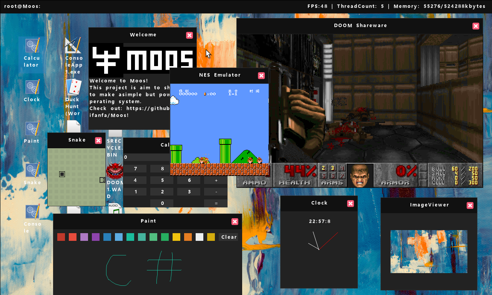

# MOOS  
  
Also provide [简体中文](README_CN.md)  
  
Welcome to the *MOOS(to make **M**y **O**wn **O**perating **S**ystem)-Project*
> MOOS is a C# x64 operating system programming with the .NET native ahead-of-time compilation technology.

*See screenshot below*

## Building
For information on compiling MOOS, please read the [build wiki page](https://github.com/nifanfa/MOOS/wiki/How-do-you-build-or-compile-MOOS%3F).

### Debug requirements
- *VMware Workstation Player - https://www.vmware.com/products/workstation-player.html*
- *Intel Hardware Accelerated Execution Manager (HAXM) - https://github.com/intel/haxm/releases*  
- *Visual studio 2022 - https://visualstudio.microsoft.com/*  
- *QEMU - https://www.qemu.org/download/ - Or you can use VMware, it's your choice*

Note: Please make sure you have at least 8GB of RAM and running a 64bit operating system.

**Have fun!**

## Demo
| Screenshot(Chinese and English are both supported in the OS, english is default) |
| ------ |
|  |
C# operating system demo, using Native AOT (Core RT) boot via multiboot  

## Project Progress

| Items | Implemented | Working On Real Hardware (Tested on Supermicro X9DRI-LN4F+ and Dell Optiplex 390) | Note |
| ----- | ----------- | ----------------------------------------------------------- | ----- |
| Applications(.exe) | ✅ | ✅ |
| Error Throwing / Catching | ❌ | ❌ | 
| GC | ⚠️ | ❓ | Not safe |
| Multiprocessor | ✅ | ✅ |
| Multithreading | ✅ | ✅ |
| EHCI(USB2.0) | ✅ | ✅ |
| USB Keyboard | ⚠️ | ❓ | Work in progress |
| USB Mouse | ✅ | ❓ |
| USB HUB | ❌ | ❌ |
| PS2 Keyboard/Mouse(USB Compatible) | ✅ | ✅ |
| Nintendo Family Computer Emulator | ✅ | ✅ |
| DOOM(doomgeneric) | ✅ | ✅ |
| Intel® Gigabit Ethernet Network | ✅ | ✅ |
| Realtek RTL8139 | ✅ | ❓ |
| ExFAT | ✅ | ✅ | Unfortunately FAT32/16/12 isn't supported! |
| I/O APIC | ✅ | ✅ |
| Local APIC | ✅ | ✅ |
| SATA | ✅ | ❓ |
| IDE | ✅ | ✅ |
| SMBIOS | ✅ | ✅ |
| ACPI | ✅ | ✅ |
| IPv4 | ✅ | ✅ |
| IPv6 | ❌ | ❌ |
| TCP(WIP) | ⚠️ | ❌ | Network can't receive large packages  |
| UDP | ✅ | ❓ |
| Lan | ✅ | ✅ |
| Wan | ✅ | ✅ |
