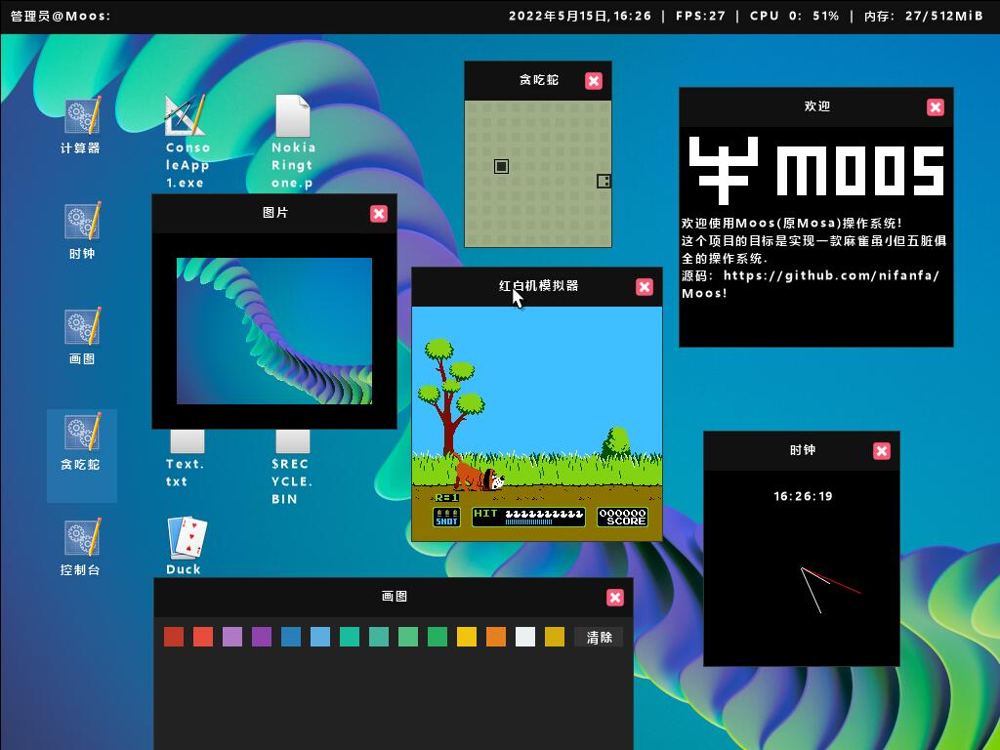

**Please join our new server!**  
https://discord.gg/egAwCZmwgY  

**Debug requirements:**  
*VMware Workstation Player https://www.vmware.com/products/workstation-player.html*  
*Intel Hardware Accelerated Execution Manager (HAXM) https://github.com/intel/haxm/releases*  
*Visual studio 2022 https://visualstudio.microsoft.com/*  
*QEMU https://www.qemu.org/download/*  
*At least 8gb of RAM, 64bit operating system*  
**Have fun!**

Welcome to ***MOOS(My own operating system)-Project***  
**Discord Server(Please rejoin!): https://discord.gg/egAwCZmwgY**  
~~**UEFI one available! check out https://github.com/nifanfa/Solution1/tree/uefi-test**~~  
C# operating system demo, using Native AOT (Core RT) boot via multiboot  
| Screenshot(English is default) |
| ------ |
|  |

| Items | Implemented | Working On Real Hardware (Tested on Supermicro X9DRI-LN4F+) | Note |
| ----- | ----------- | ----------------------------------------------------------- | ----- |
| Applications(.exe) | ✅ | ✅ |
| Error Throwing / Catching | ❌ | ❌ | 
| GC | ⚠️ | ❓ | Not safe |
| Multiprocessor | ✅ | ✅ |
| Multithreading | ✅ | ✅ |
| PS2 Keyboard/Mouse(USB Compatible) | ✅ | ✅ |
| Nintendo Family Computer Emulator | ✅ | ✅ |
| Intel® Gigabit Ethernet Network | ✅ | ✅ |
| Realtek RTL8139 | ✅ | ❓ |
| ExFAT | ✅ | ✅ | FAT32/16/12 is no supported! |
| I/O APIC | ✅ | ✅ |
| Local APIC | ✅ | ✅ |
| SATA | ⚠️ | ❌ | Can't read more than one sec at once, Can't detect sata controller on real hardware |
| IDE | ✅ | ✅ |
| SMBIOS | ✅ | ✅ |
| ACPI | ✅ | ✅ |
| IPv4 | ✅ | ✅ |
| IPv6 | ❌ | ❌ |
| TCP(WIP) | ⚠️ | ❓ | Can't receive large package |
| UDP | ✅ | ❓ |
| Lan | ✅ | ✅ |
| Wan | ✅ | ✅ 
